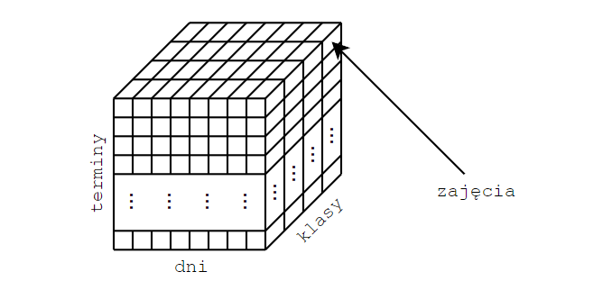

# Timetabling Problem

Projekt problemu optymalizacyjnego układania planu zajęć
dla szkół średnich.

#### 1. Uwarunkowanie i zależności
- Plan układany w wymiarze tygodniowym - 5 dni.
- Dzień jest podzielony na przedziały - 45 minut na jeden przedział.
- Uczniowie oraz nauczyciele posiadają minimalną i maksymalną ilość zajęć w ciągu dnia, kolejno 4 oraz 8 zajęć/lekcji.
- W danym dniu nie powinny występować okresy bez zajęć dla danej klasy, nauczyciel może posiadać określoną liczbę takich okresów, są to 2 lekcje (terminy).
- Żadna klasy ani nauczyciel nie mogą mieć dwóch zajęć w jednym terminie.
- Nie odbywają się więcej niż jedne zajęcia w danym dniu dla danego przedmiotu.

#### 2. Dane wejściowe
- k - liczba klas
- n - liczba nauczycieli
- l - liczba dni
- s - liczba sal
- zbiór przedmiotów występujących w planie zajęć, z ilością ich wystąpień i przypisanymi nauczycielami
- dla uproszczenia przyjęto, że jeden nauczyciel uczy jednego (danego) przedmiotu

#### 3. Struktura danych i postać rozwiązania

Dodatkowo nauczyciele i sale posiadają macierze wolnych terminów, wymiary są takie same jak dla macierzy rozwiązania
