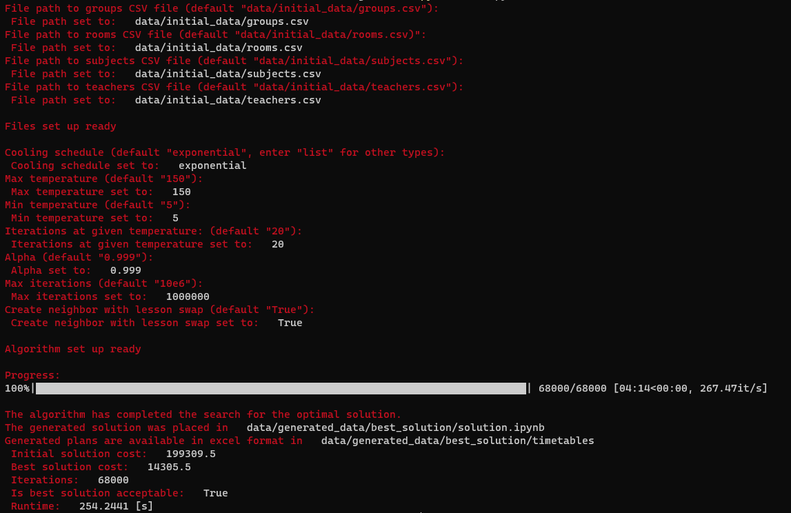
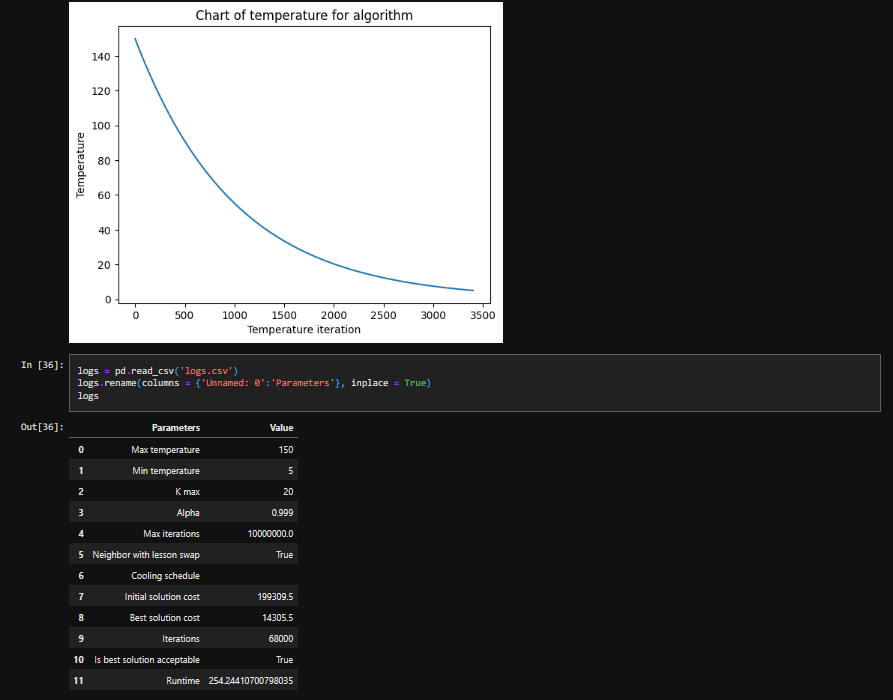
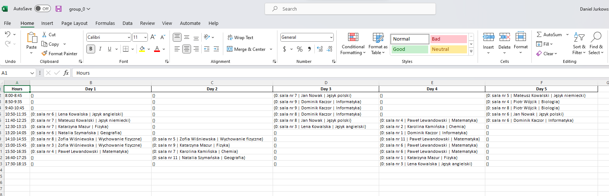

# Timetabling Problem - Problem układania planu zajęć

#### Opis projektu
Projekt rozwiązania problemu optymalizacyjnego układania planu zajęć dla
szkół średnich. Do rozwiązania problemu wykorzystano algorytm symulowanego wyżarzania wraz z
implementacją odpowiednich struktur danych. Dane wejściowe są przekazywane w plikach ".csv",
opisują one klasy, sale, nauczycieli oraz przedmioty. Wyniki otrzymujemy w postaci plików Excel
z planem dla każdej klasy. Dodatkowo jest generowany nootbook (Jupyter), który pozwala
na przegląd najlepszego rozwiązania (wyniku), wykresów dla funkcji celu oraz temperatury.
Dostępny jest również zapis parametrów, dla jakich był rozwiązywany problem.
W celu ułatwienia wprowadzania danych zostało utworzone proste GUI w terminalu, które pozwala na podanie ścieżek danych wejściowych, parametrów
algorytmu oraz dodatkowych ustawień (np. sąsiedztwo). Jako wynik otrzymujemy również
podsumowanie ze statystykami działania algorytmu.

___

#### Założenia projektowe
- Plan układany w wymiarze tygodniowym - 5 dni.
- Dzień jest podzielony na przedziały 
- Uczniowie oraz nauczyciele posiadają minimalną i maksymalną ilość zajęć w ciągu dnia, kolejno 4 oraz 8 zajęć/lekcji.
- W danym dniu nie powinny występować okresy bez zajęć dla danej klasy, nauczyciel może posiadać określoną liczbę takich okresów, są to 2 lekcje (terminy), lecz preferowany jest ich brak.
- Żadna klasy ani nauczyciel nie mogą mieć dwóch zajęć w jednym terminie.

___

#### Struktura danych rozwiązania 
Strukturą rozwiązania jest trzy wymiarowa macierz, na jej rozmiar
składają się liczba klas, liczba dni oraz liczba przedziałów w trakcie dnia. Każda komórka zawiera
obiekt lekcji, która ma informacje o nauczycielu, sali oraz przedmiocie. Dla ułatwienia sprawdzania
ograniczeń przez funkcje kary, każdy obiekt (klasa, pokój, nauczyciel) posiada własne macierze
dwu i trzy wymiarowe z dostępnymi terminami.

___

#### Wymagania do uruchomienia aplikacji
- Python >= 3.9.5
- pandas >= 1.5.1
- numpy >= 1.23.4
- matplotlib >= 3.6.0
- tqdm >= 4.64.1
- openpyxl >= 1.23.4
- XlsxWriter >= 3.0.3
- jupyter >= 1.0.0
- notebook >= 6.5.2

___

#### Uruchomienie aplikacji
`pip install -r requirements.txt`

`python main.py`

___
#### Okno aplikacji oraz wyniki 

